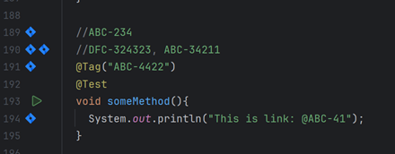
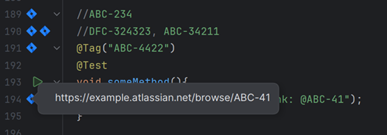

# jira-link

<!-- Plugin description -->
Simple plugin to generate annotation Jira Links for configured pattern in any type of file.

More details and description available [HERE](https://github.com/ewa-kucharek/jira-link/src/master/README.md)
<!-- Plugin description end -->

## Installation

- Manually:

  Download the [latest release](https://ziflow-automation-testing.s3.us-east-1.amazonaws.com/plugin/) and install it
  manually using
  <kbd>Settings/Preferences</kbd> > <kbd>Plugins</kbd> > <kbd>⚙️</kbd> > <kbd>Install plugin from disk...</kbd>

- Using the IDE built-in plugin system with your own plugin repository:

  If you want to create your own plugin repository you need some cloud storage with public access. What is required is
  built .zip or .jar file
  and [src/main/resources/META-INF/repository/updatePlugin.xml](src/main/resources/META-INF/repository/updatePlugin.xml)
  file.

  In this repository you can find sample JenkinsFile that builds the plugin on Kubernetes POD with docker image and
  uploads necessary files to `plugin` folder in provided S3
  bucket. This file assumes Jenkins is configured with AWS credentials and has access to S3 bucket.
  Note: Plugin version in updatePlugin.xml should be updated manually and must match the version of the built plugin.
  JenkinsFile also contains post-deploy action to send message
  to Slack channel with latest notes from CHANGELOG.md file.
  Plugin build is configured to have name: `jira-link.zip` so there can be fixed path in updatePlugin.xml

    1. Upload built plugin .zip or .jar to some cloud storage (like AWS S3) and make it public.
    2. In the same place upload updatePlugin.xml file.
       Add Custom Plugin repository: <kbd>Settings/Preferences</kbd> > <kbd>Plugins</kbd> > <kbd>⚙️</kbd> > <kbd>Manage
       Plugin Repositories...</kbd> > <kbd>+</kbd> > <kbd>
       URL</kbd> >
       `https://{your-bucket-name}.s3.{aws-region}.amazonaws.com/plugin/updatePlugin.xml`
    3. Then search for plugin in Marketplace: <kbd>Settings/Preferences</kbd> > <kbd>Plugins</kbd> > <kbd>
       Marketplace</kbd> > <kbd>Search for "jira link"</kbd> > <kbd>
       Install</kbd>

### Setup:

Go to <kbd>Settings</kbd> > <kbd>Jira Link</kbd> and provide your base Jira link e.g.
`https://example.atlassian.net/browse/` and project key e.g. `ABC`.

You can provide multiple project keys separated by `;` if needed.

## Usage:

### Jira Issue Link generation:

Plugin recognizes Jira issue pattern `ABC-XXXX` and creates a hyperlink to the issue in the editor:

When you hover over Jira icon, generated link will be shown:

When you click the icon it will open the issue in the browser.

---
Plugin based on the [IntelliJ Platform Plugin Template][template].

[template]: https://github.com/JetBrains/intellij-platform-plugin-template

